# FixIt Genie

**See. Hear. Fix.** Point your phone camera at broken equipment, describe the problem, and get expert step-by-step voice guidance in real time. Your AI repair genie.

Built with **Google ADK** + **Gemini Live API** for the [Gemini Live Agent Challenge](https://geminiliveagentchallenge.devpost.com/).

---

## What It Does

FixIt Genie is a multimodal AI agent that:

1. **Sees** through your phone camera (or optionally through connected Ray-Ban Meta glasses) — identifies equipment, reads error codes, gauges, and labels
2. **Listens** to you describe the problem — understands context and asks clarifying questions
3. **Talks you through the fix** — step-by-step voice guidance with an animated genie avatar driven by audio level, confirming each step visually before moving on
4. **Keeps you safe** — always checks safety warnings before guiding any physical action

### Demo Scenarios

- **Automotive**: Check oil, diagnose battery issues, assess coolant levels
- **Electrical**: Reset tripped breakers, troubleshoot GFCI outlets
- **Appliances**: Decode washing machine/dishwasher error codes, troubleshoot LG refrigerators

Same architecture works for industrial equipment, HVAC, plumbing, and more.

---

## Architecture

```mermaid
flowchart TD
    subgraph Inputs["Inputs to Android App"]
        CAM["Phone Camera\n(CameraX 1 FPS)"]
        MIC["Microphone\n(AudioRecord 16kHz)"]
        GLASSES["Ray-Ban Glasses\n(Meta DAT SDK v0.4.0)"]
    end

    subgraph Android["Android App (Kotlin + Jetpack Compose)"]
        APP["SessionViewModel\nAudioStreamManager\nAgentWebSocket\nGlassesCameraManager"]
    end

    subgraph CloudRun["Cloud Run — ADK Agent (Python)"]
        ADK["Google ADK · adk web\nGemini 2.5 Flash Native Audio\nSkillToolset (3 skills · 9 refs)\n6 Function Tools\nVector KB via Firestore"]
    end

    subgraph External["External Services"]
        GEMINI["Gemini 2.5 Flash\nNative Audio\n(bidi-streaming)"]
        SEARCH["Google Search\n(grounding)"]
        YT["YouTube\nTranscripts"]
        PDF["Manufacturer\nPDF Manuals"]
        FS["Firestore\nVector Search\n(gemini-embedding-001)"]
    end

    CAM -->|JPEG frames| APP
    MIC -->|PCM audio| APP
    GLASSES -->|I420 frames via Wearables SDK| APP

    APP -->|"Audio PCM 16kHz\nJPEG frames"| CloudRun
    CloudRun -->|"Audio PCM 24kHz\nTranscripts"| APP

    ADK --- GEMINI
    ADK --- SEARCH
    ADK --- YT
    ADK --- PDF
    ADK --- FS
```



**Live deployment**: Cloud Run at `us-central1` with session affinity for persistent WebSocket connections.

---

## Tech Stack

| Layer | Technology |
|-------|-----------|
| Android App | Kotlin 2.3, Jetpack Compose (BOM 2025.04.01), Material 3, CameraX 1.4.1, Hilt 2.59.2 |
| Glasses Integration | Meta DAT SDK v0.4.0 (`mwdat-core`, `mwdat-camera`), Ray-Ban Meta glasses |
| Backend Agent | Google ADK (`adk web`), Gemini 2.5 Flash Native Audio Preview, Python 3.12 |
| Knowledge Base | ADK SkillToolset (3 domain skills), Firestore vector search (gemini-embedding-001, 3072-dim) |
| Infrastructure | Google Cloud Run (2 vCPU, 2 GiB), IaC via `deploy.sh` |
| Communication | OkHttp WebSocket, ADK bidi-streaming (LiveRequest/LiveEvent protocol) |
| Backend Libraries | requests, pypdf, youtube-transcript-api |

---

## Project Structure

```
fixitbuddy/
├── android/                    # Native Android app
│   ├── app/src/main/java/ai/fixitbuddy/app/
│   │   ├── core/               # Camera, Audio, WebSocket, Config, DI, GlassesCameraManager
│   │   ├── features/           # Session, History, Settings, Onboarding
│   │   ├── navigation/         # Compose Navigation
│   │   └── ui/                 # StatusIndicator, TranscriptOverlay, CameraViewfinder
│   └── app/src/test/           # 109 unit tests + 10 glasses tests (5 instrumented, 5 unit)
├── backend/
│   ├── fixitbuddy/             # ADK agent directory
│   │   ├── agent.py            # Agent definition + SkillToolset
│   │   ├── tools.py            # 6 custom tools + vector search KB + embedded fallback
│   │   ├── config.py           # Environment config
│   │   └── skills/             # ADK domain skills
│   │       ├── automotive/     # SKILL.md + references/ (oil, battery, coolant)
│   │       ├── electrical/     # SKILL.md + references/ (breaker panel, GFCI)
│   │       └── appliances/     # SKILL.md + references/ (washer, dishwasher, fridge)
│   ├── tests/                  # 115 unit tests
│   ├── seed_knowledge.py       # Firestore seeder with gemini-embedding-001
│   ├── firestore.indexes.json  # Vector index config (3072-dim COSINE)
│   ├── Dockerfile              # Container (python:3.12-slim → adk web)
│   └── deploy.sh               # IaC Cloud Run deployment
└── docs/
    ├── blog-post.md            # Published blog post
    └── devpost-submission.md   # Submission template
```

---

## Getting Started

### Prerequisites

- Android Studio (latest)
- Google Cloud project with Gemini API key
- Python 3.12+
- gcloud CLI

### Backend Setup

```bash
cd backend

# Install dependencies
pip install -r requirements.txt

# Local development (Gemini API key, not Vertex AI)
export GOOGLE_GENAI_USE_VERTEXAI=FALSE
export GOOGLE_API_KEY=your-api-key-here
adk web --port 8080 --host 0.0.0.0 .

# Deploy to Cloud Run
chmod +x deploy.sh
GOOGLE_CLOUD_PROJECT=your-project-id GOOGLE_API_KEY=your-key ./deploy.sh
```

### Android Setup

```bash
cd android

# Backend URL is configured in gradle.properties
# For local dev: BACKEND_URL=http://10.0.2.2:8080
# For production: BACKEND_URL=https://your-cloud-run-url.run.app

./gradlew assembleDebug
# Install APK on device or emulator
```

---

## Agent Tools

### Domain Skills (via SkillToolset)

Three ADK skills provide domain-specific behavioral context. The agent calls `list_skills` to discover them and `load_skill` to load instructions on demand — keeping the context window lean until a domain is needed.

| Skill | Domain | References |
|-------|--------|-----------|
| `automotive` | Engine oil, battery, cooling | oil_system.md, battery_electrical.md, cooling_system.md |
| `electrical` | Breaker panel, GFCI | breaker_panel.md, gfci_outlets.md |
| `appliances` | Washer, dishwasher, LG fridge | washing_machine.md, dishwasher.md, lg_refrigerator.md |

### Function Tools

| Tool | Purpose |
|------|---------|
| `lookup_equipment_knowledge` | Semantic vector search via Firestore `find_nearest()` + gemini-embedding-001 (3072-dim COSINE). Fallback: keyword matching against embedded dict |
| `get_safety_warnings` | Get safety warnings before any physical action (electrical, mechanical, fluid, heat, etc.) |
| `log_diagnostic_step` | Record each diagnostic step for the session transcript |
| `google_search` | Real-time web search for error codes, repair guides, and model-specific procedures (`GoogleSearchTool` with `bypass_multi_tools_limit=True`) |
| `analyze_youtube_repair_video` | Fetch video transcript via youtube-transcript-api and summarize with Gemini; agent narrates the relevant steps verbally |
| `lookup_user_manual` | Grounded search to find the official manufacturer PDF, extract text with pypdf, summarize error codes and troubleshooting steps |

---

## Knowledge Base

Knowledge is organized in two complementary layers:

**ADK Skills** (`backend/fixitbuddy/skills/`) — domain behavioral instructions loaded on demand. Each skill's `references/` directory contains structured markdown with error code tables, diagnostic steps, visual cues, and safety notes.

**Firestore Vector Search** — `gemini-embedding-001` embeddings (3072-dim) on 9 equipment documents, queried with `find_nearest()` using COSINE similarity. "Engine oil pressure alarm" semantically matches the oil system doc even without exact keyword overlap. The embedded Python dict serves as a last-resort fallback if Firestore is unavailable.

**Coverage** (9 documents, 3 categories, 33+ error codes):
- **Automotive**: Engine oil system (P0520-P0524), car battery/electrical (P0562-P0621), cooling system (P0115-P0128)
- **Electrical**: Residential breaker panel, GFCI outlets
- **Appliances**: Washing machine (E1-E4, F1-F21, UE, OE, LE, dE, IE), dishwasher (E1-E25, E15), LG refrigerator (Er IF-Er SS, CL, dH)

---

## Safety First

FixIt Genie always calls `get_safety_warnings()` before guiding any physical action. The agent will stop and recommend calling a professional if the situation appears dangerous. Safety categories include electrical, mechanical, fluid, pressure, heat, and chemical hazards.

---

## Testing

```bash
# Backend (115 tests)
cd backend && python -m pytest tests/ -v

# Android (109 tests)
cd android && ./gradlew testDebugUnitTest
```

---

## License

MIT

---

## Built For

[Gemini Live Agent Challenge](https://geminiliveagentchallenge.devpost.com/) — Google's hackathon for multimodal AI agents that see, hear, speak, and create.

**Team**: Max Safari
