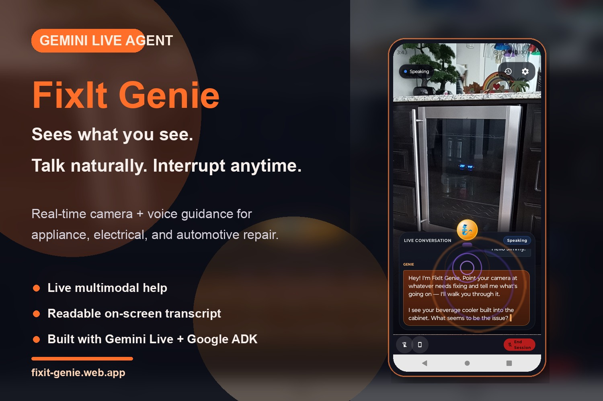
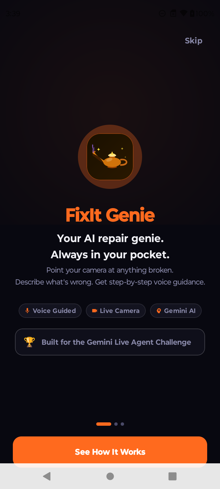
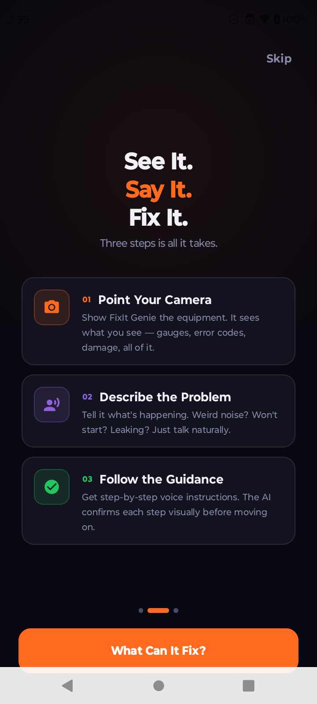
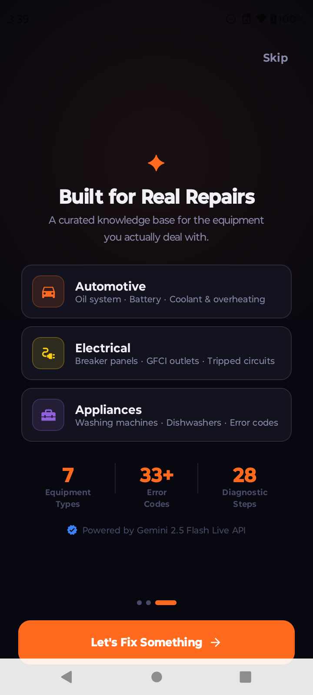
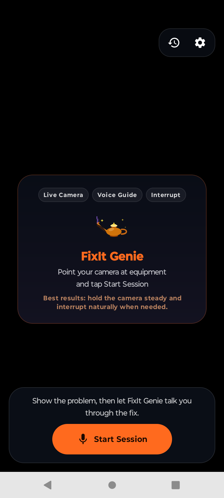
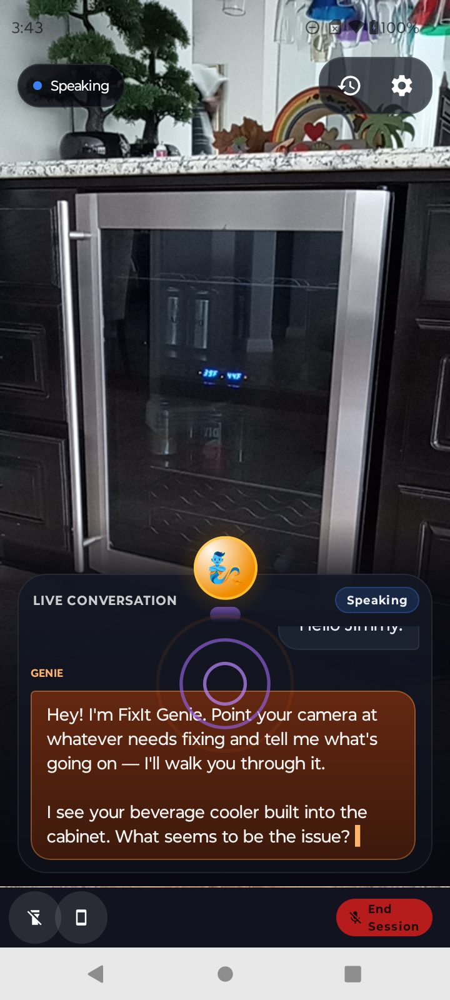
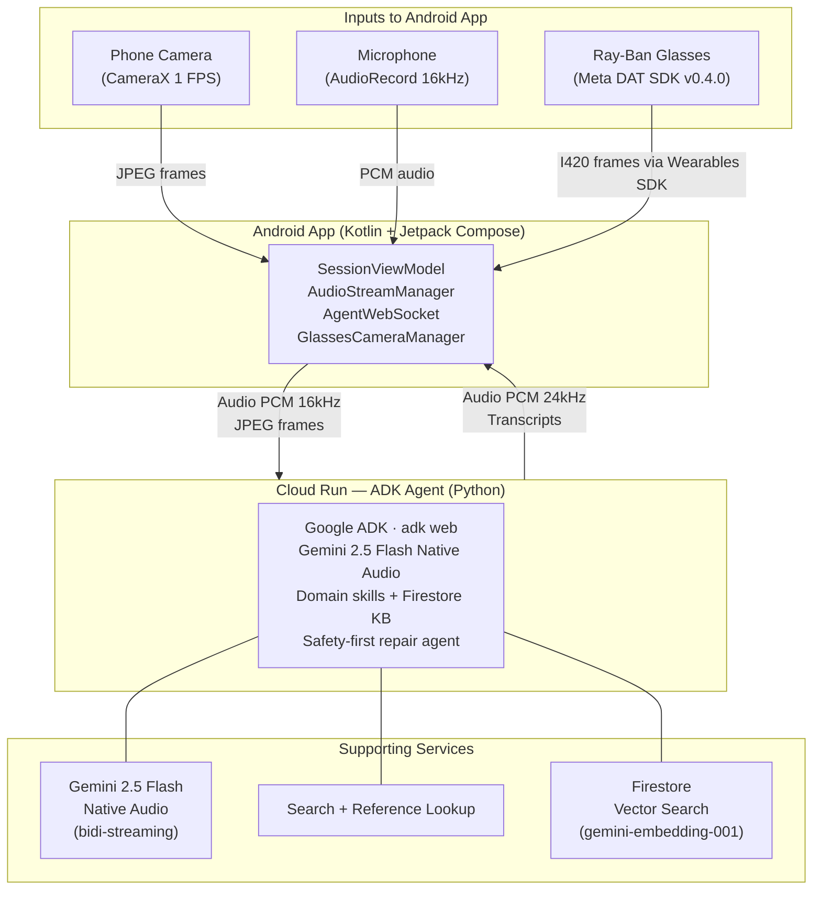

# FixIt Genie

**See. Hear. Fix.** Point your phone camera at broken equipment, describe the problem, and get expert step-by-step voice guidance in real time.

Built for the **Live Agents** category with **Google ADK** + **Gemini 2.5 Flash Native Audio**, and deployed on **Google Cloud Run** for the [Gemini Live Agent Challenge](https://geminiliveagentchallenge.devpost.com/).

---

## Quick Links

- [Live Demo Site](https://fixit-genie.web.app)
- [Technical Blog](https://fixit-genie.web.app/blog.html)
- [Cloud Deployment Proof](DEPLOYMENT.md)
- [Architecture Diagram](docs/architecture.mermaid)

---

<p align="center">
  
</p>

---

## App Preview

<table>
  <tr>
    <td align="center" width="33.33%">
      <br />
      <strong>Onboarding Intro</strong><br />
      <sub>Sets the product promise immediately: camera, voice, and guided repair.</sub>
    </td>
    <td align="center" width="33.33%">
      <br />
      <strong>How It Works</strong><br />
      <sub>Explains the core interaction simply: see it, say it, fix it.</sub>
    </td>
    <td align="center" width="33.33%">
      <br />
      <strong>Domain Coverage</strong><br />
      <sub>Shows the starting repair categories without overwhelming the user.</sub>
    </td>
  </tr>
</table>

<table>
  <tr>
    <td align="center" width="50%">
      <br />
      <strong>Ready to Start</strong><br />
      <sub>Keeps the camera view primary and the next action obvious.</sub>
    </td>
    <td align="center" width="50%">
      <br />
      <strong>Live Guidance</strong><br />
      <sub>Shows the transcript, speaking state, and camera view together during a real session.</sub>
    </td>
  </tr>
</table>

---

## Live Agent Capabilities

FixIt Genie is built for the **Live Agent** category — here's what that means in practice:

| Capability | How It Works |
|-----------|-------------|
| **Interrupt mid-speech** | Audio streams continuously to the server. Gemini's native VAD detects you speaking while the agent talks and sends `interrupted: true` — the app immediately clears the audio queue and listens. No button press needed. |
| **Bidirectional streaming** | OkHttp WebSocket + ADK LiveRequest/LiveEvent protocol. Audio (16kHz PCM) and video (1 FPS JPEG) stream up; audio (24kHz PCM) and transcripts stream back — simultaneously, in real time. |
| **Agent sees without being told** | Camera frames arrive continuously. The agent identifies equipment, reads error codes and gauges, and calls out what it notices — without you naming anything. |
| **Natural pacing** | Gemini's native VAD handles turn detection automatically. No push-to-talk, no start/stop signals. Say "wait" or "hold on" mid-response and the agent stops. |
| **Function calls mid-conversation** | The agent can consult the knowledge base and supporting reference tools without breaking the live conversation flow. |

## What It Does

FixIt Genie is a multimodal AI agent that:

1. **Sees** through your phone camera (or Ray-Ban Meta glasses for hands-free) — identifies equipment, reads error codes, gauges, and labels in real time
2. **Listens** to you describe the problem — understands context, asks clarifying questions
3. **Talks you through the fix** — step-by-step voice guidance with an animated genie avatar, confirming each step visually before moving on
4. **Keeps you safe** — always checks safety warnings before guiding any physical action

### Demo Scenarios

| Domain | Equipment | Coverage |
|--------|-----------|----------|
| Automotive | Engine oil, battery, cooling system | P0520-P0524, P0562-P0621, P0115-P0128 |
| Electrical | Breaker panel, GFCI outlets | Visual diagnosis + safe reset procedures |
| Appliances | Washing machine, dishwasher, LG fridge | E1-E4, F1-F21, UE, OE, Er IF-Er SS + 33 more |

---

## Architecture



**Live deployment**: Cloud Run at `us-central1` with session affinity for persistent WebSocket connections.

---

## Tech Stack

| Layer | Technology |
|-------|-----------|
| Android App | Kotlin 2.3, Jetpack Compose (Material 3), CameraX 1.4.1, Hilt 2.59.2 |
| Glasses | Meta DAT SDK v0.4.0 (`mwdat-core`, `mwdat-camera`) |
| Backend Agent | Google ADK (`adk web`), Gemini 2.5 Flash Native Audio, Python 3.12 |
| Knowledge Base | ADK SkillToolset (3 domain skills), Firestore vector search (gemini-embedding-001, 1536-dim COSINE) |
| Infrastructure | Google Cloud Run (2 vCPU, 2 GiB), IaC via `deploy.sh` |
| Communication | OkHttp WebSocket, ADK bidi-streaming (LiveRequest/LiveEvent protocol) |

---

## Quick Start

### Option 1 — Run the Android App Against a Deployed Backend

Point `BACKEND_URL` in `android/gradle.properties` at your deployed service, then install the Android app.

```bash
git clone https://github.com/dabra-labs/fixIt-genie
cd fixIt-genie/android

# Configure BACKEND_URL in gradle.properties first
./gradlew installDebug
```

### Option 2 — Run Everything Locally

```bash
git clone https://github.com/dabra-labs/fixIt-genie
cd fixIt-genie

# Install backend dependencies
pip install -r backend/requirements.txt

# Start backend + Android emulator in one command
export GOOGLE_API_KEY=your-gemini-api-key
./dev.sh --android
```

`dev.sh` handles: backend startup, emulator boot detection, APK build + install, and app launch. Run `./dev.sh --help` for options.

### Option 3 — Deploy Your Own Cloud Run Backend

```bash
export GOOGLE_CLOUD_PROJECT=your-gcp-project-id
export GOOGLE_API_KEY=your-gemini-api-key

cd backend && ./deploy.sh
```

`deploy.sh` is full IaC — enables APIs, creates Artifact Registry, builds the container via Cloud Build, deploys to Cloud Run, and verifies the service is responding. Run with `DRY_RUN=1 ./deploy.sh` to preview without deploying.

---

## Agent Tools

### Domain Skills (ADK SkillToolset)

Three domain skills loaded on demand — the agent calls `list_skills` to discover them and `load_skill` to load instructions for the active domain. Keeps the context window lean until a domain is needed.

| Skill | Domain | References |
|-------|--------|-----------|
| `automotive` | Engine oil, battery, cooling | `oil_system.md`, `battery_electrical.md`, `cooling_system.md` |
| `electrical` | Breaker panel, GFCI | `breaker_panel.md`, `gfci_outlets.md` |
| `appliances` | Washer, dishwasher, LG fridge | `washing_machine.md`, `dishwasher.md`, `lg_refrigerator.md` |

### Function Tools

| Tool | Purpose |
|------|---------|
| `lookup_equipment_knowledge` | Semantic vector search via Firestore `find_nearest()` + `gemini-embedding-001` (1536-dim COSINE). Fallback: keyword matching |
| `get_safety_warnings` | Safety warnings before any physical action — non-negotiable in the system prompt |
| `log_diagnostic_step` | Session transcript logging |
| `google_search` | Web grounding for unknown error codes and model-specific procedures |
| `lookup_user_manual` | Pulls in official manufacturer documentation when the embedded KB is not enough |
| `analyze_youtube_repair_video` | Optional transcript-based repair-video summarization for long-tail troubleshooting cases |

---

## Project Structure

```
fixitgenie/
├── android/                    # Native Android app (Kotlin + Jetpack Compose)
│   ├── app/src/main/java/ai/fixitbuddy/app/
│   │   ├── core/               # Camera, Audio, WebSocket, DI, GlassesCameraManager
│   │   ├── features/           # Session, History, Settings, Onboarding
│   │   ├── navigation/         # Compose NavHost
│   │   └── design/             # Material 3 theme (Safety Orange + Tool Blue)
│   └── app/src/test/           # Android unit tests
├── backend/
│   ├── fixitbuddy/             # ADK agent package
│   │   ├── agent.py            # Agent definition + SkillToolset
│   │   ├── tools.py            # Agent tools + embedded KB fallback
│   │   ├── config.py           # Environment config
│   │   └── skills/             # automotive/, electrical/, appliances/
│   ├── tests/                  # Backend test suite
│   ├── Dockerfile              # python:3.12-slim → adk web
│   ├── deploy.sh               # IaC: Cloud Run deployment
│   └── requirements.txt
├── images/                     # Curated app screenshots for README and website
├── hosting/                    # Firebase Hosting (fixit-genie.web.app)
│   └── public/
│       ├── index.html          # Demo landing page
│       ├── blog.html           # Technical blog post
│       └── images/             # Hosted screenshots for the demo site
├── dev.sh                      # Local dev: backend + Android emulator
└── docs/                       # Public architecture diagrams and blog source
```

---

## Reproducible Testing

Use the steps below to validate the project quickly and consistently.

Recommended test setup: use a **physical Android device** for the full live camera + voice flow. An emulator is useful for app launch and UI validation, but the complete live-agent experience is best tested on hardware.

### 1. Run automated tests

```bash
# Backend
cd backend && python -m pytest tests/ -v

# Android
cd android && ./gradlew testDebugUnitTest
```

### 2. Run the app locally

```bash
export GOOGLE_API_KEY=your-gemini-api-key
./dev.sh --android
```

### 3. Reproduce the core live-agent flow

1. Launch the Android app and start a live session.
2. Point the camera at an appliance, electrical panel, or automotive component.
3. Ask a natural question such as `What do you notice here?`
4. Let the agent respond, then interrupt it with `wait` or `stop`.
5. Confirm that the transcript updates and the agent adapts the response in real time.

Expected behavior:

- the app streams camera and voice in real time
- the agent responds with spoken guidance and on-screen transcript updates
- the user can interrupt the live response naturally
- the backend remains live on Google Cloud Run throughout the session

---

## Google Cloud + Gemini Services Used

| Service | Purpose |
|---------|---------|
| **Cloud Run** | Hosts the ADK agent — persistent WebSocket, session affinity, auto-scaling |
| **Cloud Build** | Builds the container image via `deploy.sh` |
| **Artifact Registry** | Stores the Docker image |
| **Cloud Firestore** | Vector search knowledge base (`gemini-embedding-001`, 1536-dim COSINE) |
| **Gemini API** | `gemini-2.5-flash-native-audio-latest` for bidi-streaming, `gemini-2.5-flash` for supporting tool calls |

---

## License

MIT — Munish Dabra

Built for the [Gemini Live Agent Challenge](https://geminiliveagentchallenge.devpost.com/).
